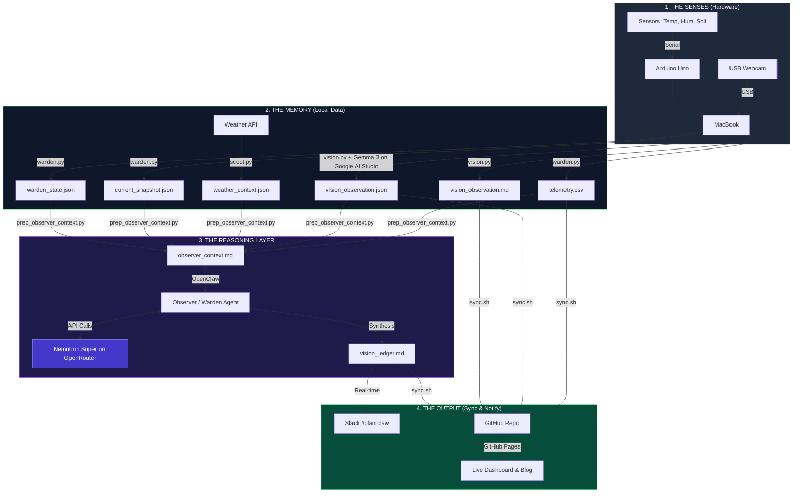

---
hide:
  - navigation
  - toc
---

# 🏗️ The Architecture of GardenOS

GardenOS is a **Resilient Digital Twin** of a physical desk-top biome. It is built as a set of decoupled layers so local sensing, visual interpretation, reasoning, and publishing can each continue independently.

## 📡 System Data Flow

---

## 🌎 The Environmental Story: Biome & Context

GardenOS connects the **Tropical Macro-Context** of Chennai with the **Human-Gated Micro-Context** of the room.

### 1. The Chennai Outdoors (The Macro-Context)
* **The Solar Battery**: The room is on the **1st floor with an open terrace above**. This terrace acts as a thermal battery, soaking up the intense Chennai sun and radiating heat into the room between **12:00 and 15:00**.
* **The Tropical Air**: Outside is high-energy and humid (~30°C+). This is the drift state when cooling is inactive.

### 2. The Room Geometry (The Protective Shield)
* **North Window (2m away)**: Provides **pure indirect diffuse light**. No UV spikes, no sun-scorch.
* **East Wall**: A physical shield against the direct morning sun, keeping the biome shaded during the early hours.

### 3. The Cooling Hierarchy (The Human-Gated Pulse)
The room climate is controlled by a human-comfort loop:
* **Fan S (South)**: The baseline air exchange. Always ON when the human is present.
* **Fan N (North)**: Auxiliary air movement for additional heat management.
* **The AC**: The final thermal resort. It clamps temperature at **26°C** but drops humidity and raises VPD.

### 4. The Desk (The Isolated Stage)
* **Wooden Surface**: Acts as a thermal insulator, decoupling the pots from the desk mass.
* **The White Rabbit (50mm)**: The system's scale anchor, providing a constant mm-scale reference.

---

## 🛠️ Layer Breakdown

### 1. The Physical Layer
The hardware is intentionally simple. The **Arduino Uno** reads a DHT11 for atmosphere and capacitive moisture sensors for plant roots.

### 2. The Data Layer (Local-First)
Everything is recorded locally on a **MacBook Air**. Even if the WiFi fails, the system continues to log telemetry, vision observations, and context artifacts to local files. This is the system's black box recorder.

### 3. The Intelligence Layer
This is a split intelligence layer. `vision.py` uses **Gemma 3 via Google AI Studio** to turn images into `vision_observation.json` and `vision_observation.md`. `warden.py` combines telemetry with the vision artifact and writes `current_snapshot.json` and `warden_state.json`. `prep_observer_context.py` packages telemetry, metrics, weather, `vision_observation.json`, `current_snapshot.json`, `warden_state.json`, and the world model into `observer_context.md`. The observer uses **OpenClaw** with **Nemotron Super via OpenRouter** to reconcile sensor and visual evidence into a hypothesis, active concerns, and a narrative report.

### 4. The Public Layer
The final layer turns code and data into a narrative. We use **MkDocs-Material** to build a static site that reads the latest repository artifacts directly from GitHub.

---

## 🛡️ Resilience Philosophy
* **Decoupled**: If the reasoning layer fails, the local data still updates.
* **Stateless Dashboard**: The website doesn't have a database; it reads repository artifacts directly.
* **Atomic Sync**: Data is pushed in checkpoints via Git for reliability.
