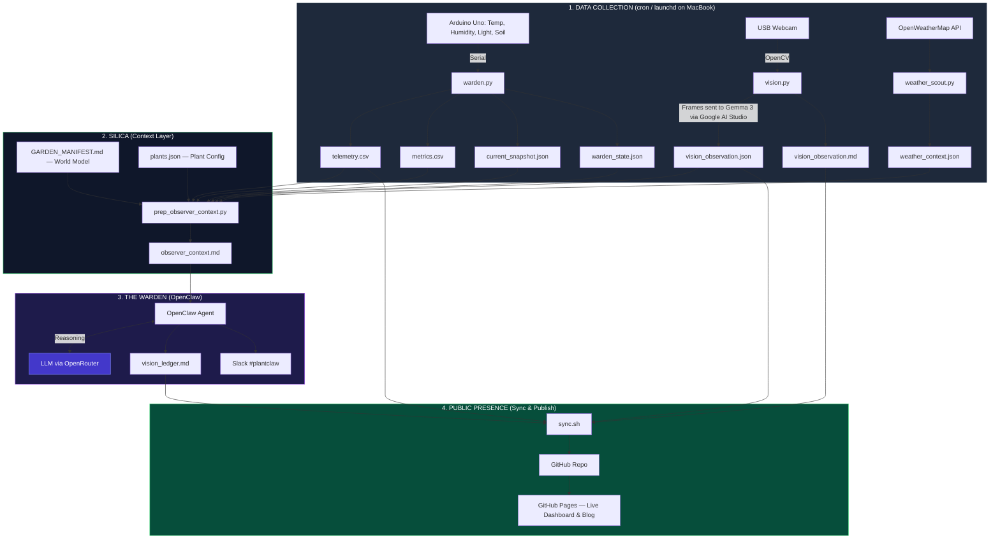

---
hide:
  - navigation
  - toc
---

# 🏗️ The Architecture of GardenOS

GardenOS is a **Resilient Digital Twin** of a physical desk-top biome. It is built as a set of decoupled layers so local sensing, visual interpretation, reasoning, and publishing can each continue independently.

## 📡 System Data Flow

---

## 🌎 The Environmental Story: Biome & Context

GardenOS connects the **Tropical Macro-Context** of Chennai with the **Human-Gated Micro-Context** of the room.

### 1. The Chennai Outdoors (The Macro-Context)
* **The Solar Battery**: The room is on the **1st floor with an open terrace above**. This terrace acts as a thermal battery, soaking up the intense Chennai sun and radiating heat into the room between **12:00 and 15:00**.
* **The Tropical Air**: Outside is high-energy and humid (~30°C+). This is the drift state when cooling is inactive.

### 2. The Room Geometry (The Protective Shield)
* **North Window (2m away)**: Provides **pure indirect diffuse light**. No UV spikes, no sun-scorch.
* **East Wall**: A physical shield against the direct morning sun, keeping the biome shaded during the early hours.

### 3. The Cooling Hierarchy (The Human-Gated Pulse)
The room climate is controlled by a human-comfort loop:
* **Fan S (South)**: The baseline air exchange. Always ON when the human is present.
* **Fan N (North)**: Auxiliary air movement for additional heat management.
* **The AC**: The final thermal resort. It clamps temperature at **26°C** but drops humidity and raises VPD.

### 4. The Desk (The Isolated Stage)
* **Wooden Surface**: Acts as a thermal insulator, decoupling the pots from the desk mass.
* **The White Rabbit (50mm)**: The system's scale anchor, providing a constant mm-scale reference.

---

## 🛠️ Layer Breakdown

### 1. The Data Collection Layer (System-Level)

Three independent scripts run on the MacBook via **cron/launchd** — no orchestrator, no framework. They run at the OS level and write flat files to `data/`.

- **`warden.py`** connects to the Arduino over serial, reads temperature, humidity, light, and soil moisture, and writes `telemetry.csv`, `metrics.csv`, `current_snapshot.json`, and `warden_state.json`.
- **`vision.py`** captures a frame from the USB webcam via OpenCV, then sends it to **Gemma 3 on Google AI Studio** for visual interpretation. The model describes what it sees — leaf color, posture, soil surface — and the output is written to `vision_observation.json` and `vision_observation.md`. Gemma 3 handles *perception* here, not reasoning.
- **`weather_scout.py`** fetches current Chennai weather from OpenWeatherMap, providing the outdoor macro-context. Output goes to `weather_context.json`.

OpenClaw has **zero involvement** in this layer. These scripts run independently whether or not the reasoning layer is online.

### 2. The SILICA Context Layer

SILICA is not a single script or service — it's a **collection of scripts and artifacts** that bridge raw data and LLM reasoning. Its job is to convert raw telemetry into **semantic facts** and prevent the LLM from hallucinating based on outdoor Chennai climate.

The key components:

- **`prep_observer_context.py`** — the synthesizer. It reads all Layer 1 outputs, merges them with the World Model and plant config, and produces a single `observer_context.md` file.
- **`GARDEN_MANIFEST.md`** — the World Model. Codifies the physical constants of the biome: lighting geometry, atmospheric microclimate, human occupancy patterns, cooling hierarchy.
- **`scripts/config/plants.json`** — plant species metadata, sensor calibration values, and dry thresholds.

The result is that the LLM never sees raw CSV rows. It sees semantic facts like "VPD: EXTREME at 3.5 kPa, rising trend" and "Soil Moisture p1 (Nickels): DRY, below threshold."

### 3. The Warden / Observer (OpenClaw)

OpenClaw receives `observer_context.md` as its input and calls an LLM to reason about plant health. The Warden cross-verifies sensor data against visual evidence, detects anomalies, and produces care recommendations. Output is written to `logs/vision_ledger.md` and sent to Slack `#plantclaw`.

### 4. The Public Layer

`sync.sh` builds the MkDocs site, commits all data and artifacts to GitHub, and pushes to GitHub Pages. The live dashboard at `surendranb.github.io/gardenbot` reads CSVs directly from the GitHub repo — no database, no backend.

---

## 🛡️ Resilience Philosophy
* **Decoupled**: If the reasoning layer fails, the local data still updates. If weather fails, sensors still log. Each layer is independent.
* **Stateless Dashboard**: The website doesn't have a database; it reads repository artifacts directly.
* **Atomic Sync**: Data is pushed in checkpoints via Git for reliability.
