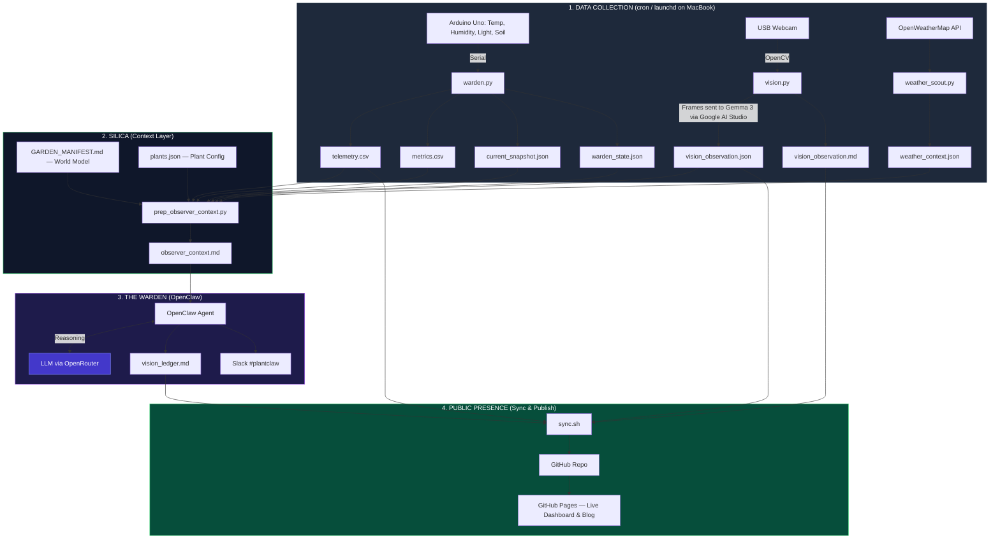

---
hide:
  - navigation
  - toc
---

# 🏗️ The Architecture of GardenOS

GardenOS is a digital twin of a desk-top biome. It's built as decoupled layers — sensing, context, reasoning, and publishing each run independently, so if one breaks the others keep going.

## 📡 System Data Flow

---

## 🌎 The Environment

The biome sits in Chennai, but the outdoor climate has almost nothing to do with what happens on the desk. That disconnect is the whole reason the context layer exists.

### The outdoors
The room is on the 1st floor with an open terrace above. That terrace soaks up Chennai sun all day and radiates heat into the room between noon and 3pm. Outside it's typically 30°C+ with high humidity. That's the drift state when cooling is off.

### The room
The north window (2m from the desk) gives only indirect diffuse light — no UV spikes, no scorch. The east wall blocks morning sun entirely. So the plants never see direct sunlight.

### Cooling
The room climate follows a human-comfort hierarchy:

* Fan S (south): baseline air exchange, always on when I'm at the desk
* Fan N (north): extra airflow when it's hot
* The AC: last resort. Clamps temp at 26°C but tanks humidity and pushes VPD up

### The desk
Wooden surface, acts as a thermal insulator. The pots are decoupled from the desk mass. There's a white rabbit figurine (50mm) that serves as a mm-scale reference for the camera.

---

## 🛠️ Layer Breakdown

### 1. Data collection

Three Python scripts run on the MacBook via cron/launchd. No orchestrator, no framework — they just run at the OS level and write flat files to `data/`.

`warden.py` connects to the Arduino over serial and reads temp, humidity, light, and soil moisture. It writes `telemetry.csv`, `metrics.csv`, `current_snapshot.json`, and `warden_state.json`.

`vision.py` grabs a frame from the webcam via OpenCV, then sends it to Gemma 3 on Google AI Studio for visual interpretation. Gemma 3 describes what it sees — leaf color, posture, soil surface — and the output goes to `vision_observation.json` and `vision_observation.md`. This is perception only, not reasoning.

`weather_scout.py` fetches current Chennai weather from OpenWeatherMap for the outdoor macro-context. Output goes to `weather_context.json`.

OpenClaw has nothing to do with this layer. These scripts run whether or not the reasoning layer is alive.

### 2. SILICA (context layer)

SILICA is a collection of scripts and config files that sit between raw data and the LLM. The job is to turn CSV rows into something the model can actually reason about, and to stop it from hallucinating based on outdoor Chennai weather.

`prep_observer_context.py` reads all the data files from layer 1, merges them with `GARDEN_MANIFEST.md` (the world model — physical constants of the biome) and `scripts/config/plants.json` (species, calibration, thresholds), and produces one file: `observer_context.md`.

The LLM never sees raw telemetry. It gets things like "VPD: 3.5 kPa, rising trend" and "Soil p1 (Nickels): dry, below threshold." That's the whole point.

### 3. The Warden (OpenClaw)

OpenClaw reads `observer_context.md` and sends it to an LLM. The model reasons about plant health — cross-checking sensors against visual evidence, comparing against recent history, flagging anything that needs attention. Output goes to `logs/vision_ledger.md` and gets posted to Slack `#plantclaw`.

### 4. Publishing

`sync.sh` builds the MkDocs site, commits everything to GitHub, and pushes to GitHub Pages. The dashboard reads CSVs straight from the repo. No database, no backend.

---

## 🛡️ Resilience

* If reasoning fails, data still collects. If weather fails, sensors still log. Each layer is independent.
* The dashboard is stateless — it reads repo artifacts directly, no database.
* Data syncs via git commits, so every push is an atomic checkpoint.
