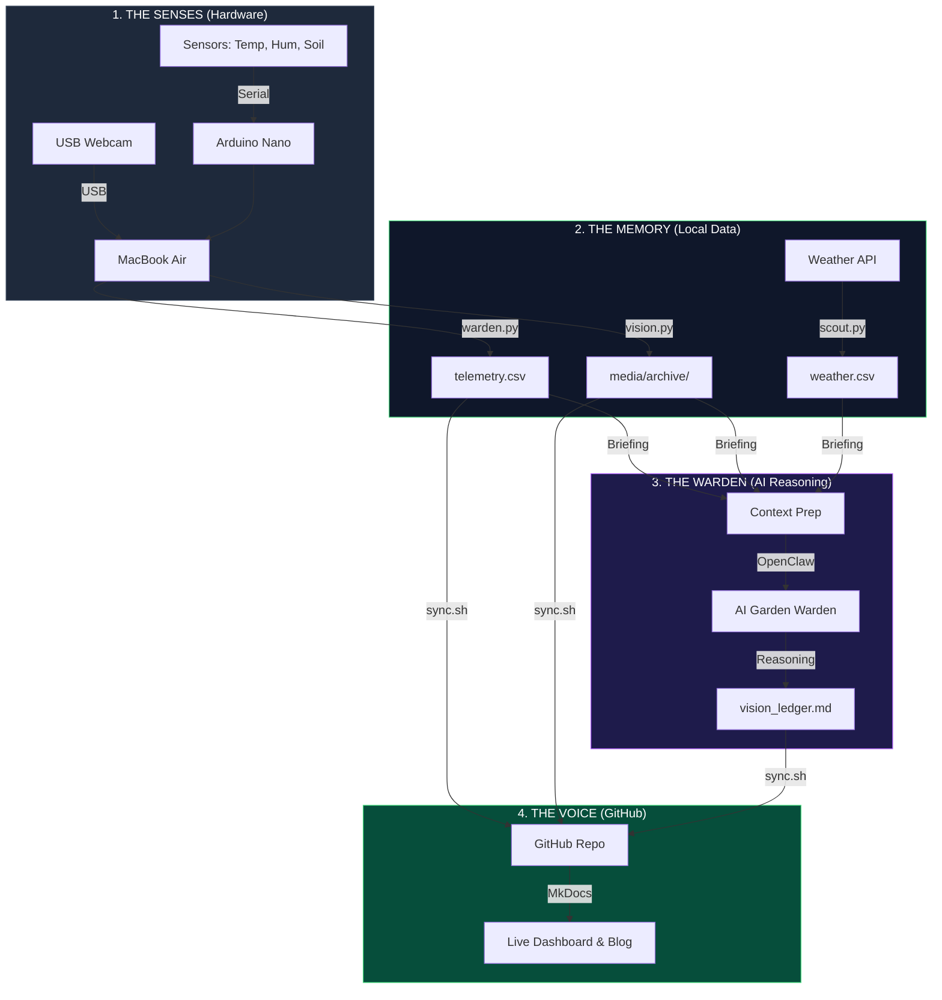

---
hide:
  - navigation
  - toc
---

# 🏗️ The Architecture of GardenOS

GardenOS is designed to be a **Resilient Digital Twin** of a physical desk-top biome. Instead of a single complex program, it is built as a series of decoupled layers that ensure data is never lost, even if the internet goes down.

## 📡 System Data Flow

---

## 🛠️ Layer Breakdown

### 1. The Physical Layer
The hardware is "dumb" by design. The **Arduino** simply reads electrical signals and streams them over USB. We use **Capacitive Sensors** to avoid the corrosion common in cheaper IoT setups, ensuring the data stays clean for years.

### 2. The Data Layer (Local-First)
Everything is recorded locally on a **MacBook Air**. Even if the WiFi fails, the system continues to log data to CSV files. This is our "Black Box" recorder. If the internet returns after a week, the system simply pushes the entire history at once.

### 3. The Intelligence Layer
This is the "Brain" powered by **OpenClaw**. Every 3 hours, an AI agent acts as a **Curious Warden**. It doesn't just trust the sensors; it cross-references the photo with the data. 
> *Example: If a sensor says "Dry" but the AI sees "Turgid Leaves," it flags a sensor error instead of telling the human to water.*

### 4. The Public Layer
The final layer turns code and data into a narrative. We use **MkDocs-Material** to build a static site that fetches your data directly from GitHub. This makes the dashboard fast, free to host, and accessible to anyone.

---

## 🛡️ Resilience Philosophy
*   **Decoupled**: If the AI fails, the graphs still update. 
*   **Stateless Dashboard**: The website doesn't have a database; it reads raw files.
*   **Atomic Sync**: Data is pushed in "checkpoints" via SSH for maximum security and reliability.
