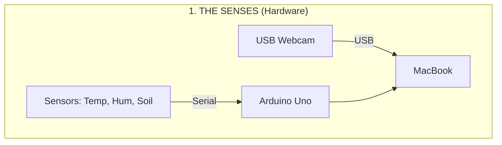

---
hide:
  - navigation
  - toc
---

# 🏗️ The Architecture of GardenOS

GardenOS is designed to be a **Resilient Digital Twin** of a physical desk-top biome. Instead of a single complex program, it is built as a series of decoupled layers that ensure data is never lost, even if the internet goes down.

## 📡 System Data Flow

---

## 🌎 The Environmental Story: Biome & Context

GardenOS doesn't exist in a vacuum. It is a bridge between the **Tropical Macro-Context** of Chennai and the **Human-Gated Micro-Context** of your room.

### 1. The Chennai Outdoors (The Macro-Context)
*   **The Solar Battery**: The room is on the **1st floor with an open terrace above**. This terrace acts as a thermal battery, soaking up the intense Chennai sun and radiating heat into the room between **12:00 and 15:00**.
*   **The Tropical Air**: Outside is high-energy and humid (~30°C+). This represents the "Drift" state of the room when cooling is inactive.

### 2. The Room Geometry (The Protective Shield)
*   **North Window (2m away)**: Provides **Pure Indirect Diffuse Light**. No UV spikes, no sun-scorch. It's a stable, "Soft Box" lighting environment.
*   **East Wall**: A physical shield against the direct morning sun, ensuring the biome remains cool and shaded during the early hours.

### 3. The Cooling Hierarchy (The Human-Gated Pulse)
The room's climate is controlled by a human-comfort loop:
*   **Fan S (South)**: The baseline air exchange. Always ON when the human is present, ensuring the plants never sit in stagnant air.
*   **Fan N (North)**: Auxiliary air movement for additional heat management.
*   **The AC**: The final thermal resort. It clamps the temperature at **26°C** but crashes the humidity, creating a "Violent VPD Spike" that the Warden must reconcile.

### 4. The Desk (The Isolated Stage)
*   **Wooden Surface**: Acts as a thermal insulator, decoupling the pots from the building's thermal mass.
*   **The White Rabbit (50mm)**: The system's scale anchor, providing a constant mm-scale reference in an ever-changing visual environment.

---

## 🛠️ Layer Breakdown

### 1. The Physical Layer
The hardware is "dumb" by design. The **Arduino Uno** reads signals from a DHT11 (Atmosphere) and three **Capacitive Moisture Sensors (TLC555)**. We use capacitive sensors because standard resistive sensors rely on DC current passing through the soil, which causes electrolysis and rapid corrosion of the probes.

### 2. The Data Layer (Local-First)
Everything is recorded locally on a **MacBook Air**. Even if the WiFi fails, the system continues to log data to CSV files. This is our "Black Box" recorder. If the internet returns after a week, the system simply pushes the entire history at once.

### 3. The Intelligence Layer
This is the "Brain" powered by **OpenClaw**. Every 3 hours, an AI agent acts as a **Curious Warden**. It doesn't just trust the sensors; it cross-references the photo with the data. 
> *Example: If a sensor says "Dry" but the AI sees "Turgid Leaves," it flags a sensor error instead of telling the human to water.*

### 4. The Public Layer
The final layer turns code and data into a narrative. We use **MkDocs-Material** to build a static site that fetches your data directly from GitHub. This makes the dashboard fast, free to host, and accessible to anyone.

---

## 🛡️ Resilience Philosophy
*   **Decoupled**: If the AI fails, the graphs still update. 
*   **Stateless Dashboard**: The website doesn't have a database; it reads raw files.
*   **Atomic Sync**: Data is pushed in "checkpoints" via SSH for maximum security and reliability.