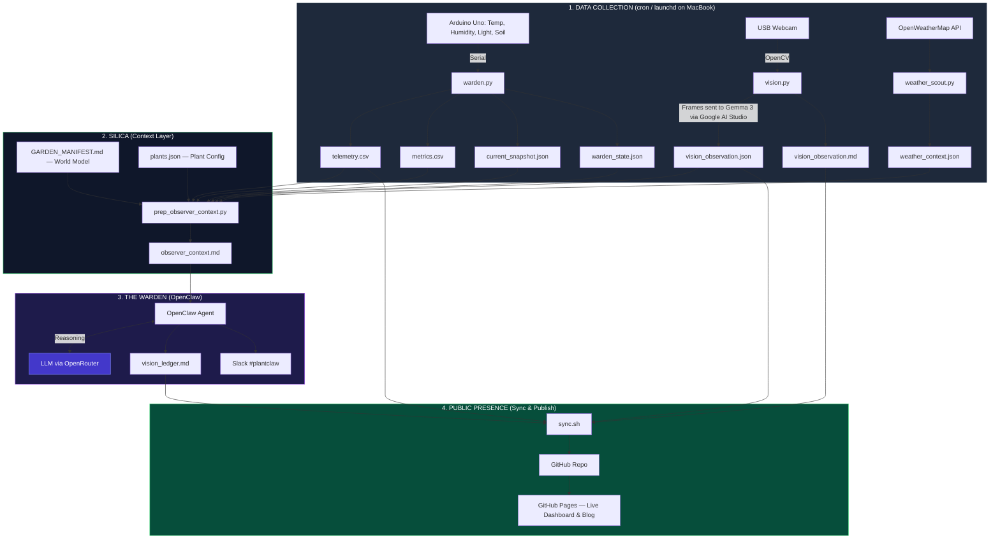

---
hide:
  - navigation
  - toc
---

# 🏗️ The Architecture of GardenOS

<style>
/* Full Width Overrides */
.md-content__inner { max-width: none !important; margin: 0 !important; padding: 1rem 2rem !important; }
.md-main__inner { max-width: none !important; }
.md-sidebar { display: none !important; }
</style>

GardenOS is a digital twin of a desk-top biome. It's built as decoupled layers — sensing, context, reasoning, and publishing each run independently, so if one breaks the others keep going.


## 📡 System Data Flow



---

## 🌎 The Environment

The biome sits in Chennai, but the outdoor climate has almost nothing to do with what happens on the desk. That disconnect is the whole reason the context layer exists.

### The outdoors
The room is on the 1st floor with an open terrace above. That terrace soaks up Chennai sun all day and radiates heat into the room between noon and 3pm. Outside it's typically 30°C+ with high humidity. That's the drift state when cooling is off.

### The room
The north window (2m from the desk) gives only indirect diffuse light — no UV spikes, no scorch. The east wall blocks morning sun entirely. So the plants never see direct sunlight.

### Cooling
The room climate follows a human-comfort hierarchy:

* **Fan S** (south): baseline air exchange, always on when I'm at the desk
* **Fan N** (north): extra airflow when it's hot
* **The AC**: last resort — clamps temp at 26°C but tanks humidity and pushes VPD up

### The desk
Wooden surface, acts as a thermal insulator. The pots are decoupled from the desk mass. There's a white rabbit figurine (50mm) that serves as a mm-scale reference for the camera.

---

## 🛠️ Layer Breakdown

### 1. Data Collection

Three Python scripts run on a schedule via **cron/launchd** on the MacBook. Each one collects a different type of data and writes it to flat files in `data/`.

**`warden.py`** — connects to the Arduino over serial and reads from four sensors:

* **DHT11**: temperature and humidity
* **Lux sensor**: ambient light level
* **3 capacitive soil probes**: one per pot (p1: Nickels, p2: Mint, p3: Pothos)

Every reading gets written to `telemetry.csv`. Here's what a couple of rows look like:

```
timestamp,temp,hum,light,p1,p2,p3
2026-03-21 14:32:02,32.0,26.0,776,860.0,218.0,295.0
2026-03-21 14:35:57,32.0,26.0,796,864.0,219.0,295.0
```

It also writes `metrics.csv` (computed values like VPD), `current_snapshot.json`, and `warden_state.json`.

**`vision.py`** — captures a frame from the USB webcam via OpenCV, then sends it to **Gemma 3 on Google AI Studio**. Gemma looks at the image and describes what it sees — leaf posture, color, soil surface condition. This is *perception*, not reasoning. Here's a sample of its output:

> *"The latest image shows a stable garden state. All plants maintain their established postures and leaf counts. The white rabbit remains within the Pothos pot, serving as a consistent scale reference."*

The full observation gets written to `vision_observation.json` (structured data with image paths and baseline references) and `vision_observation.md` (the human-readable description above).

**`weather_scout.py`** — calls the OpenWeatherMap API for current Chennai conditions. This gives us the outdoor macro-context, which matters because the indoor microclimate is completely different. Here's a sample:

```json
{
  "main": { "temp": 26.08, "humidity": 85, "pressure": 1009 },
  "weather": { "main": "Mist", "description": "mist" },
  "forecast": { "rain_expected": false, "max_pop": 0 }
}
```

Output goes to `weather_context.json`.

---

### 2. SILICA (Context Layer)

SILICA sits between raw data and the LLM. Its job is to turn all those CSV rows and JSON files into **semantic facts** — plain-language statements the model can reason about — and to ground the LLM in the physical reality of the desk so it doesn't hallucinate based on outdoor weather.

It's made up of three things:

**`GARDEN_MANIFEST.md`** — the **world model**. I wrote this by hand. It codifies things the LLM can't infer from sensors alone:

* The north-facing window gives only indirect diffuse light, and the east wall blocks all morning sun
* The AC clamps temperature at 26°C but crushes humidity below 30%
* The terrace above radiates solar heat into the room between noon and 3pm
* Fan S runs whenever I'm at the desk, creating high air exchange that dries leaf surfaces
* I'm present at the desk ~12 hours a day, which adds CO2 and body heat within 1 meter

**`scripts/config/plants.json`** — plant configuration. Species names, which sensor channel maps to which pot, and the soil moisture thresholds that define "dry" vs "wet" for each plant.

**`prep_observer_context.py`** — the synthesizer. It reads all the Layer 1 data files, merges them with the world model and plant config, and produces one file: `observer_context.md`. Here's a sample of what the LLM actually receives:

```
- VPD State: EXTREME (Critical Stress) at 3.521 kPa (Rising trend: 0.286).
- Hydration Stagnancy: p1 is flat (Δ-1.2%). Check for root-stasis or sensor drift.
- Human Occupancy: HIGH. Fan S (South) is active; localized air exchange is manual.
```

The LLM gets these pre-digested facts instead of parsing raw CSVs. That's the core of what SILICA does.

---

### 3. The Warden (OpenClaw)

OpenClaw reads `observer_context.md` and sends it to an LLM. The model reasons about plant health — cross-checking sensors against visual evidence, comparing against recent history, and flagging anything that needs attention. Output goes to `logs/vision_ledger.md` and gets posted to Slack `#plantclaw`.

---

### 4. Publishing

`sync.sh` builds the MkDocs site, commits everything to GitHub, and pushes to GitHub Pages. The live dashboard reads CSVs straight from the repo.

---

## 🛡️ Resilience

* If reasoning fails, data still collects. If weather fails, sensors still log. Each layer is independent.
* The dashboard is stateless — it reads repo artifacts directly.
* Data syncs via git commits, so every push is an atomic checkpoint.
