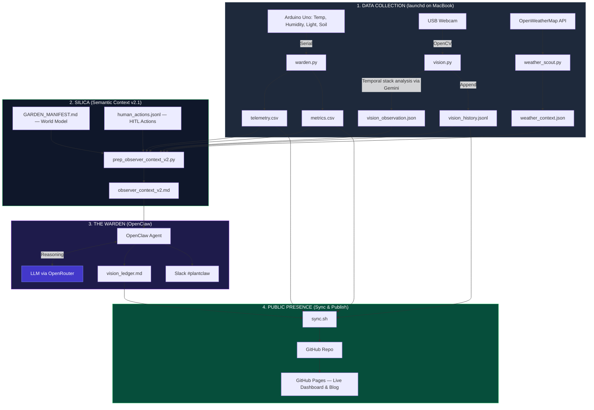

---
hide:
  - navigation
  - toc
---

# 🏗️ The Architecture of GardenOS

<style>
/* Full Width Overrides */
.md-content__inner { max-width: none !important; margin: 0 !important; padding: 1rem 2rem !important; }
.md-main__inner { max-width: none !important; }
.md-sidebar { display: none !important; }

.center-img {
  display: flex;
  justify-content: center;
  margin: 2rem 0;
}
</style>


GardenOS is a digital twin of a desk-top biome. It's built as decoupled layers — sensing, context, reasoning, and publishing each run independently, so if one breaks the others keep going.

<div align="center">
  
</div>

## 📡 System Data Flow



---

## 🌎 The Environment

The biome sits in Chennai, but the outdoor climate has almost nothing to do with what happens on the desk. That disconnect is the whole reason the context layer exists.

### The outdoors
The room is on the 1st floor with an open terrace above. That terrace soaks up Chennai sun all day and radiates heat into the room between noon and 3pm. Outside it's typically 30°C+ with high humidity. That's the drift state when cooling is off.

### The room
The north window (2m from the desk) gives only indirect diffuse light — no UV spikes, no scorch. The east wall blocks morning sun entirely. So the plants never see direct sunlight.

### Cooling
The room climate follows a human-comfort hierarchy:

* **Fan S** (south): baseline air exchange, always on when I'm at the desk
* **Fan N** (north): extra airflow when it's hot
* **The AC**: last resort — clamps temp at 26°C but tanks humidity and pushes VPD up

### The desk
Wooden surface, acts as a thermal insulator. The pots are decoupled from the desk mass. There's a white rabbit figurine (50mm) that serves as a mm-scale reference for the camera.

---

## 🛠️ Layer Breakdown

### 1. Data Collection

Three Python scripts run on independent **launchd** schedules on the MacBook. Each one collects a different type of data and writes it to flat files in `data/`.

**`warden.py`** — connects to the Arduino over serial and reads from four sensors:

* **DHT11**: temperature and humidity
* **Lux sensor**: ambient light level
* **3 capacitive soil probes**: one per pot (p1: Nickels, p2: Mint, p3: Pothos)

Every reading gets written to `telemetry.csv` and `metrics.csv`.

**`vision.py`** — captures a frame from the USB webcam via OpenCV, then samples a multi-day temporal sequence (Historical Peak Stress + Today's morning recovery + Now). This stack is sent to **Gemini on Google AI Studio** for a meticulous "Expert Visual Ethologist" audit. It identifies specific orientation-calibrated physical changes (leaf count, color gradients, postural shifts) and provides pixel-based health inferences.

The output is written to `vision_observation.json` (latest) and appended to `vision_history.jsonl` (historical log).

**`weather_scout.py`** — calls the OpenWeatherMap API for current Chennai conditions. To minimize API overhead, this runs on a separate twice-daily schedule (06:00 and 18:00).

Output goes to `weather_context.json`.

---

### 2. SILICA (Context Layer v2.1)

SILICA v2.1 is the "Brain" of GardenOS. It sits between raw data and the LLM. Instead of a simple data dump, it performs **Semantic Synthesis** — turning CSV rows into high-level botanical facts and visual trajectories.

It's made up of four key components:

**`GARDEN_MANIFEST.md`** — the **world model**. It codifies the physical constants of the desk biome (window orientation, AC behavior, fan placement).

**`human_actions.jsonl`** — the **HITL (Human-in-the-Loop) Log**. Every manual action (misting, watering, sensor checks) is recorded here. In v2.1, these actions serve as **Master Overrides** that can invalidate historical "Hardware Issue" patterns.

**`prep_observer_context_v2.py`** — the **Expert Synthesizer**. This script calculates three temporal layers for the LLM:
* **The Pulse (4h)**: High-resolution immediate impact.
* **The Day (24h)**: Overnight recovery analysis.
* **The Rhythm (72h/7d)**: Metabolic trends and growth baselines.

**`observer_context_v2.md`** — the output. Here's a sample of the **Biological Tempo** the LLM receives:

```
- VPD Rhythm: Current avg 3.6 kPa (Stable).
- P1 Velocity: 📈 REHYDRATING (-5.5% last 4h) | 7d Baseline: +30.4% (🌿 THRIVING).
- P2 Velocity: ⚖️ MAINTAINING (-1.2% last 4h) | 7d Baseline: -27.0% (⚠️ STRESSED).
```

---

### 3. The Warden (OpenClaw)

OpenClaw reads `observer_context_v2.md` and sends it to an LLM. The model performs a **Evidence Reconciliation** — cross-checking Section 2 (Sensors) against Section 3 (Vision History) and Section 0 (Human Action). It ignores historical errors if Section 0 shows a resolution.

---

### 4. Publishing

`sync.sh` builds the MkDocs site, commits everything to GitHub, and pushes to GitHub Pages. The live dashboard reads CSVs straight from the repo.

---

## 🛡️ Resilience

* If reasoning fails, data still collects. If weather fails, sensors still log. Each layer is independent.
* The dashboard is stateless — it reads repo artifacts directly.
* Data syncs via git commits, so every push is an atomic checkpoint.
