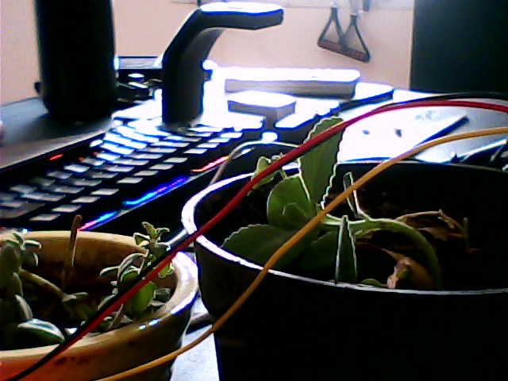
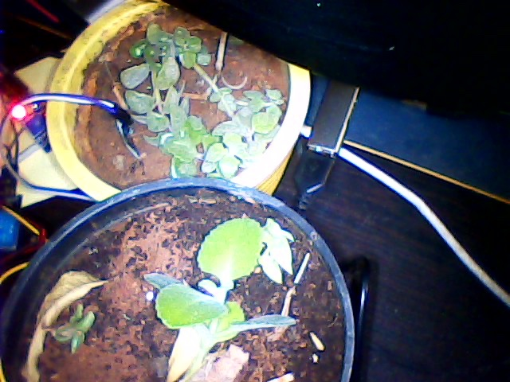
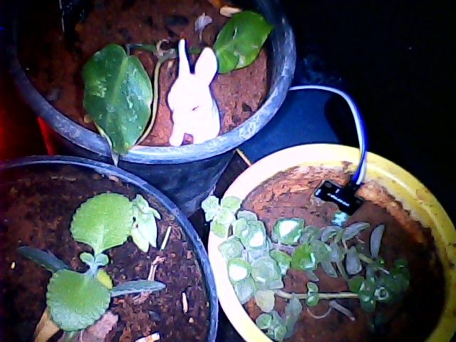
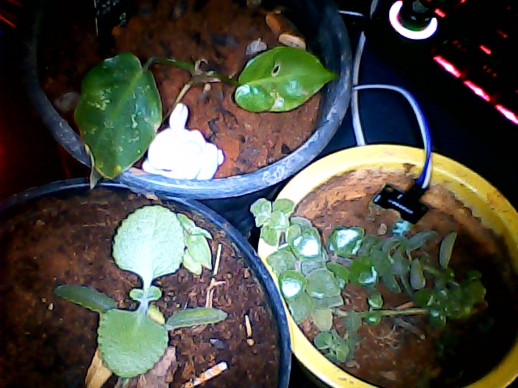
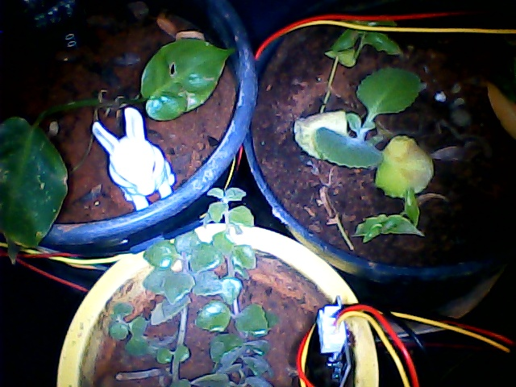
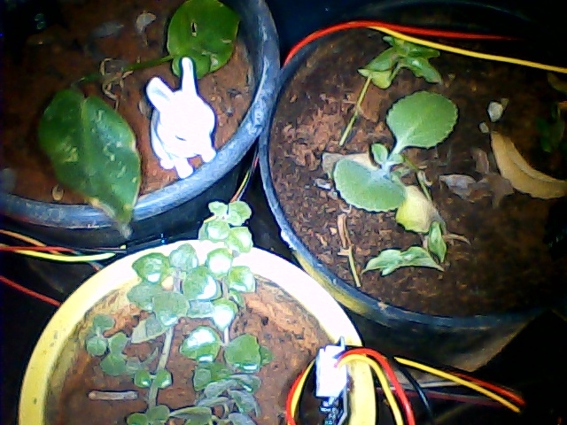

# Daily Baseline Gallery

A temporal record of the garden's state, captured daily at 06:00 AM. This provides the primary visual baseline to track macro-growth, leaf elongation, and overall canopy health over time. The 50mm White Rabbit figurine is stationary across all captures to provide absolute scale.

## March 20, 2026

## March 21, 2026

## March 22, 2026

## March 23, 2026

## March 24, 2026

## March 25, 2026

