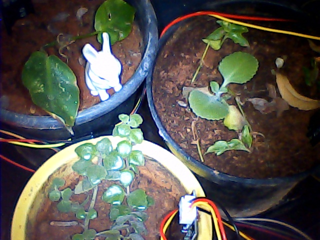

# 🌿 GardenOS Live Telemetry

-   :material-thermometer: __Atmosphere__
     --°C
    |
    --%
    
VPD: -- kPa

-   :material-leaf: __Water Levels (Wetness %)__
    

    p1 (Nickels): <strong id="p1-val">--</strong> - ... 
    p2 (Mint): <strong id="p2-val">--</strong> - ... 
    p3 (Pothos): <strong id="p3-val">--</strong> - ...
    

    
Light Exposure: -- Lux

-   :material-camera: __Live Vision__
    

        
    

## 72-Hour Telemetry Trends

    <canvas id="telemetryChart"></canvas>

## Live Observer Log

    Latest AI Insight
    Syncing...

    Waiting for report...

